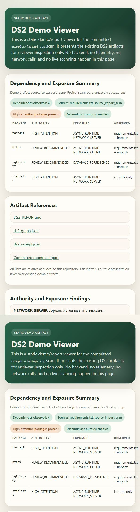
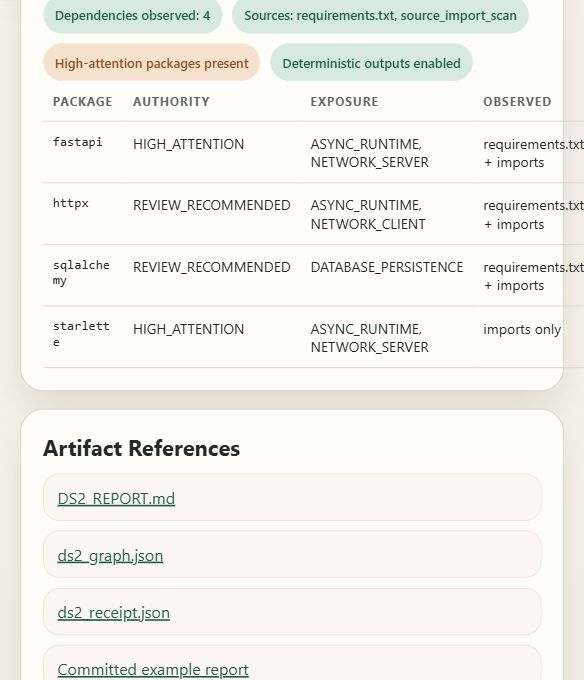
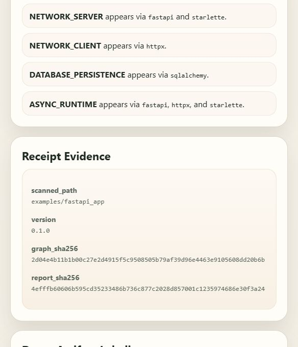

# DS2

DS2 is `ps + netstat + tree for dependency/runtime authority`.

Current release candidate: `v0.1.0`.

In one command, it turns a Python repo into a deterministic map of declared dependencies, observed imports, runtime exposure classes, and inherited execution authority. The goal is not vulnerability hype or static-analysis theater. The goal is a reviewer-trustworthy artifact that shows what code you pulled in, what runtime surface it appears to open, and where human attention should go next.

For evaluators: DS2 is a deliberately scoped governance artifact for AI-assisted software workflows. It emphasizes reproducibility, honest boundaries, and low-friction local evaluation over feature sprawl.

## One-Minute Evaluator Flow

```bash
python -m pip install -e .
python -m pip install pytest
python -m ds2.cli scan examples/fastapi_app --out artifacts/demo
python -m pytest
```

Expected review path:

- Open `artifacts/demo/DS2_REPORT.md` first.
- Check `artifacts/demo/ds2_receipt.json` for stable hashes.
- Compare with `examples/fastapi_app/` for committed reference artifacts.

## What It Is

- A local CLI for understanding direct dependencies and observed runtime surface.
- A deterministic report generator for dependency topology and authority expansion.
- A lightweight review aid for server, client, process, browser, database, cache, and cloud-adjacent packages.

## What It Is Not

- Not a generic CVE scanner.
- Not a secret collector.
- Not a package installer or resolver.
- Not a complete SBOM system.
- Not a guarantee of runtime reachability.

## How DS2 Relates To SBOM, SLSA, And Provenance

DS2 is not an SBOM generator. It does not try to replace CycloneDX, SPDX, provenance attestations, or build-integrity frameworks.

Instead, DS2 complements SBOM and provenance work by mapping dependency exposure and inherited authority surfaces: what a repo appears to import, what runtime classes those imports imply, and where reviewer attention should go before execution.

Future compatibility is intended around CycloneDX/SPDX-style export and in-toto/SLSA-style workflows, but that integration is explicitly future work rather than part of `v0.1.0`.

## Reviewer Demo

```bash
python -m ds2.cli scan examples/fastapi_app --out artifacts/demo
```

```text
$ python -m ds2.cli scan examples/fastapi_app --out artifacts/demo
DS2 report generated: .../artifacts/demo/DS2_REPORT.md
DS2 receipt generated: .../artifacts/demo/ds2_receipt.json
```

Outputs appear in:

- `artifacts/demo/DS2_REPORT.md`
- `artifacts/demo/ds2_graph.json`
- `artifacts/demo/ds2_receipt.json`

Static demo/report viewer:

- `docs/demo-viewer.html`
- Local preview:

```bash
python -m http.server 8765
```

Then open:

- `http://127.0.0.1:8765/docs/demo-viewer.html`

Screenshot previews:





## Install And Dev

```bash
python -m pip install -e .
python -m pip install pytest
python -m ds2.cli version
python -m ds2.cli scan examples/fastapi_app --out artifacts/demo
python -m pytest
```

## CLI

```bash
ds2 --version
ds2 version
ds2 scan .
ds2 scan . --out .ds2 --json
ds2 explain fastapi
```

## Evaluator Tour

- Sample app: `examples/fastapi_app`
- Sample report: `examples/fastapi_app/DS2_REPORT.md`
- Sample graph: `examples/fastapi_app/ds2_graph.json`
- Sample receipt: `examples/fastapi_app/ds2_receipt.json`
- Reviewer flow: `artifacts/demo`
- Static demo/report viewer: `docs/demo-viewer.html`
- Artifact framing: `ARTIFACT_SUMMARY.md`
- Static-analysis boundaries: `LIMITATIONS.md`
- Future integration direction: `docs/FUTURE_INTEGRATIONS.md`
- Quick evaluator path: `REVIEWER_QUICKSTART.md`
- Release gate: `RELEASE_CHECKLIST.md`

## Philosophy

Dependencies do not just add code. They expand inherited execution authority. A package that opens sockets, starts subprocesses, drives browsers, touches persistent storage, or reaches cloud APIs changes the effective authority surface of the repo that imports it.

DS2 focuses on that question first: what execution authority is now inside the graph, how was it observed, and where should a reviewer pay attention.

## V1 Limitations

- See `LIMITATIONS.md`.

## V2 Direction

DS2 v2 is aimed at generation-aware dependency governance for coding agents: tracking how generated code expands dependency authority, comparing intended versus introduced surface, and enforcing review gates around inherited execution power.
